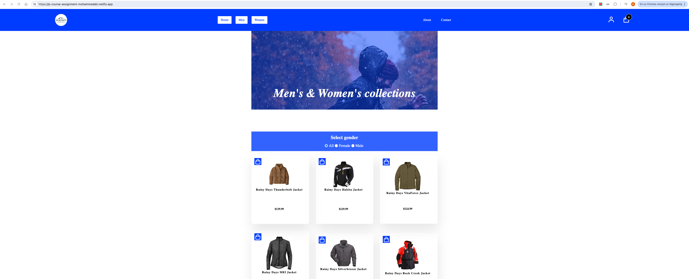

# JavaScript 1 - Course Assignment


This image showcases the product display, featuring images, descriptions, and pricing.

## Brief Description

This project involves using JavaScript to create an interactive online store that fetches products from an API. The aim is to dynamically display products in HTML, allowing users to browse items, add them to a basket, and complete the checkout process. Styling is optional but recommended to improve the user experience.

### User Stories

- **View Product List:** Users can see a list of products on the homepage.
- **Filter Products:** Users can filter products by category, gender, or genre.
- **Product Details:** Each product has a dedicated page showing more details when clicked.
- **Add to Basket:** Users can add products to their basket.
- **Remove from Basket:** Users can remove items from their basket.
- **View Cart Summary:** Users can review the basket contents on the checkout page.
- **Order Confirmation:** Users receive a thank you message after successfully checking out.

### Required Pages

- **Home Page:** `/index.html`
- **Product Page:** `/product/index.html`
- **Checkout Page:** `/checkout/index.html`
- **Confirmation Page:** `/checkout/confirmation/index.html`

### Optional Pages

- **Category Pages**
- **Terms and Conditions Page**
- **Privacy Policy Page**
- **My Profile Page**

## Process

1. **Project Setup:** I decided to use the existing HTML and CSS from my cross-course project.
2. **API Selection:** I chose the Rainy Days API and reviewed its documentation to understand the available endpoints.
3. **Development:** I worked through the requirements step by step, implementing the necessary JavaScript functionalities.
4. **Testing:** I thoroughly tested my work and sought peer feedback for improvements.
5. **Review:** I offered feedback on two other students' projects to enhance collaboration.
6. **Final Adjustments:** I made final changes based on the feedback received and ensured code cleanliness.
7. **Submission:** I submitted my project on GitHub along with a written reflection on the entire process.

## Resources

- **API Endpoints:**
  - Rainy Days API: [Documentation](https://docs.noroff.dev/docs/v1/e-commerce/rainy-days)

## Important Features Implemented

- **Error Handling:** Users are notified of errors, such as failed API calls.
- **Loading Indicator:** A loading indicator is displayed during asynchronous actions to inform users that data is being loaded.
- **Dynamic Data:** Product data is fetched dynamically from the API, avoiding any hardcoded data in the final submission.
- **Accessibility:** The site is designed to be accessible and usable for all users, following best practices.
- **Asynchronous Actions:** `async`/`await` syntax is used for handling asynchronous actions to enhance code readability.
- **Console Logs:** All `console.log` statements have been removed before submission to ensure a clean codebase.

## Delivery

- **GitHub Repository:** JavaScript code has been submitted in the default (main/master) branch.
- **Written Reflection:** A reflection on the assignment process has been provided, discussing the approach and lessons learned.

## Built With

- HTML
- CSS
- Javascript

## Getting Started

To get a copy of this project up and running on your local machine, follow these steps:

1. **Prerequisites:**

   - Ensure you have a modern web browser installed (e.g., Chrome, Firefox).
   - Have a code editor set up (e.g., Visual Studio Code, Sublime Text).

2. **Clone the Repository:**
   Open your terminal and run the following command to clone the repository:

   ```bash
   git clone https://github.com/MohammedAbi/javaScript-1-Course-Assignment-Mohammed-Abi.git

   ```

3. Navigate to the Project Directory: Change into the project directory.

   ```bash
   cd javaScript-1-Course-Assignment-Mohammed-Abi/info

   ```

4. Open the Project: Open the index.html file in your preferred web browser to view the application.

5. Explore the Features: Now you can explore the application, test its features, and review the code!

## Links

- [Website deployed via Netlify](https://js-1-course-assignment-mohammedabi.netlify.app)
- [GitHub repo](https://github.com/MohammedAbi/javaScript-1-Course-Assignment-Mohammed-Abi)

## Contact

- [My LinkedIn page](https://www.linkedin.com/in/mohammedabdulabi/)

## Acknowledgments

### Tutorials

- [Create a Shopping Cart With Vanilla JavaScript | ES6 - By Code Explained](https://www.youtube.com/watch?v=UcrypywtAm0&list=PLf9jWAVTVXo_pkSMDn3GFQBqNpS2mSPVg&index=48)
- [Ten Steps to Mastering the Fetch API - By Steve Griffith - Prof3ssorSt3v3](https://www.youtube.com/watch?v=2sQ9xiEAXNo&list=PLf9jWAVTVXo_pkSMDn3GFQBqNpS2mSPVg&index=47)
- [ChatGPT](https://chat.openai.com) - Used for problem-solving and guidance during development.
